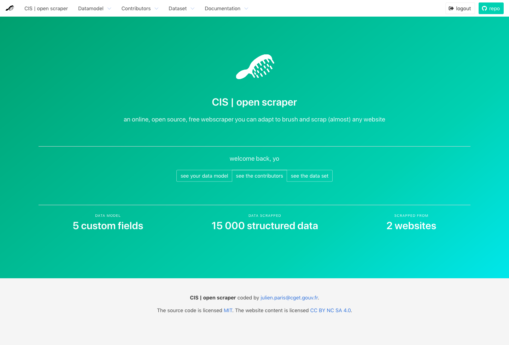
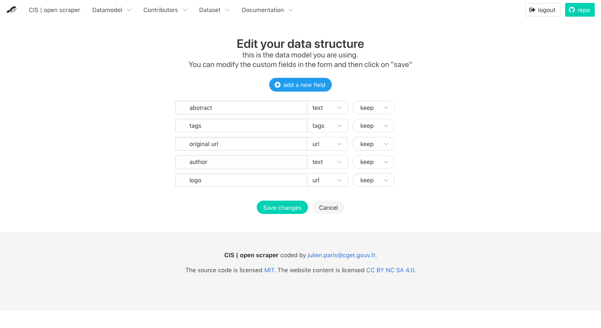
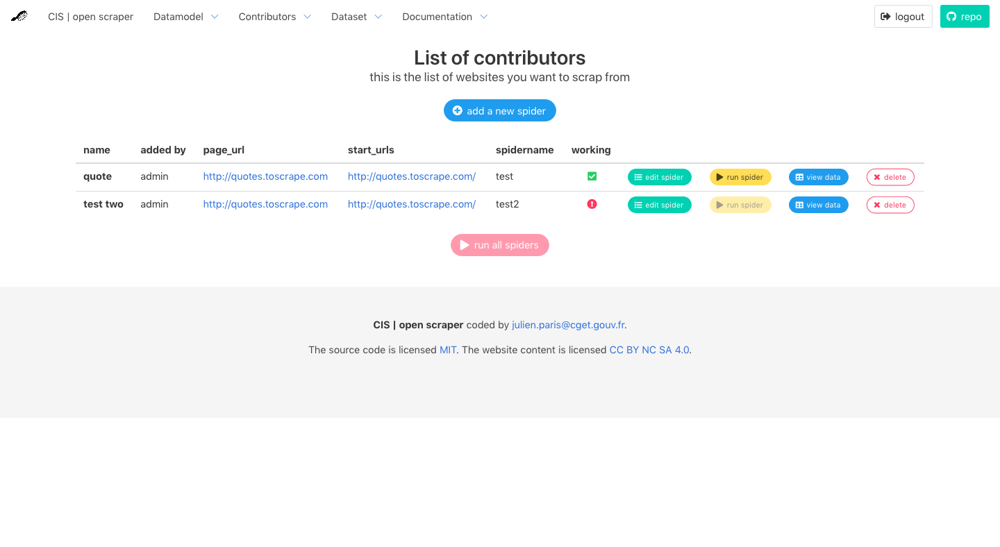

# OpenScraper

### a project by [SocialConnect](https://entrepreneur-interet-general.etalab.gouv.fr/defi/2017/09/26/socialconnect/)

A generic Scrapy crawler wrapped in a Tornado framework with a nice interface, so almost anyone with very little technical knowledge could scrap public data and install/adapt it for its own purposes. 

... anyway that's the goal folks ! ...

----

#### **To which needs this project aims to answer ?**
Scraping can quickly become a mess, mostly if you need to scrap several websites in order to eventually get a structured dataset. Usually you need to set up several scrapers for every website, configure the spiders one by one, get the data from every website, and clean up the mess to get from this raw material one structured dataset you know that exists... 

So you have mainly two choices : either use a proprietary and expensive service (like [Apify](https://www.apify.com/) or [import.io](https://www.apify.com/)) and depend on an external service, or write your own code (for instance based on BeautifulSoup or Scrapy), adapt it for your own purposes, and usually be the only one to be able to use/adapt it. 

To make that job a bit easier OpenScraper aims to display a GUI interface (a webapp on the client side) so you'll just have to set the field names (the data structure you expect), then enter a list of websites to scrap, for each one set up the xpath to scrap for each field, and finally click on a button to run the scraper configured for each website... and tadaaaa you'll have your data... 

#### **A theoretical use case**
So let's say you have a list of different websites you want to scrap projects from, each website having some urls where are listed projects (in my case social innovation projects). For every project you know it could be described with : a title, an abstract, an image, a list of tags, an url, and the name and url of the source website... So from OpenScraper you would have to : 
- specify the data structure you expect ("title", "abstract", etc...) ;
- add a new _contributor_ (a source website) : at least its _name_ and the _start_url_ from which you'll do the scraping ; 
- configure the spider for every _contributor_, i.e. specify the xpaths for every field (xpath for "title", xpath for "abstract", etc... );
- save the _contributor_ spider configuration, and click on the "run spider" button... 
- the data will be stored in the OpenScraper database (MongoDB), so you could later retrieve the structured data (with an API endpoint or in a tabular file)

-------

## INSTALLATION WALKTHROUGH

1. **clone or download the repo**
1. **install MongoDB locally** or get the URI of the MongoDB you're using
1. **go to your openscraper folder**
1. **setup (without virtual environment)**

	> $ pip install -r requirements.txt

1. **update the `config/settings.py` file** with your mongoDB URI (if you're not using default mongoDB connection)

1. **run app** from `$ ~/../app_scrapnado`

	> $ python main.py

1. **check in your browser** at `localhost:8000`

1. **create/update your datamodel** at `localhost:8000/datamodel/edit`

1. **create/update your spiders** at `localhost:8000/contributors`

1. **run the test spider in the browser** at `localhost:8000/crawl/testspider`

------

### STACK
- _Language_ : **Python**... because let's be honest, I don't manage so many languages for that kind of project
- _Backend_  : **Tornado** [(link)](http://www.tornadoweb.org/en/stable/)... one of the few async/non-blocking Python frameworks
- _Scraping_ : **Scrapy** [(link)](https://scrapy.org/), perhaps with **Selenium for Python** [(link)](http://selenium-python.readthedocs.io/) inside or **splash** for jquery follow-up...
- _Frontend_ : **Bulma** [(link)](https://bulma.io/) (to make it nice) and then **Vue.js** [(link)](https://vuejs.org/) (to make it async)

### TECH GOALS
- web interface to edit the data structure
- Python asynchronous interface (Tornado) for Scrapy 
- store a list of url sources + corresponding xpaths in a DB (Mongo)
- web interface to edit the sources' xpath list
- display the list of sources + for each add a button to run the scraper
- store/extract results in the DB

----- 

### ROADMAP FOR MVP
1. understand basics of Tornado (reuse some tutorial material)
1. basic Tornado + MongoDB setup
1. understand basics of Scrapy
1. UI to create user (register), create/update a datamodel, create/update a spider configuration
1. create a generic spider (class) + generic item to fill, both callable from handlers
1. integrate generic spider + tests + run
1. make Tornado and a basic scrapy spider work together (non-blocking)
1. add a GUI to configure the data structure you expect from the scraping
1. make a nice front in Bulma 
1. ... nicer front in vue.js
1. GUI to edit also fields' names (structure of the scrapping)

------

### CURRENTLY... 
- currently at step /4 - /5
- running scrapy from browser with a basic generic crawler
- create item to fill on the fly (genericItem)
- ...

### Notes / issues
- the generic spider need to be tested on various websites configurations
- must add a feature to use Selenium inside a spider if needed (ajax or .click function)

-------
## Credits 

- the [SocialConnect](https://entrepreneur-interet-general.etalab.gouv.fr/defi/2017/09/26/socialconnect/) project, aka "Carrefour des Innovations Sociales"
- the [EIG](https://entrepreneur-interet-general.etalab.gouv.fr/) program by [Etalab](https://www.etalab.gouv.fr/)
- [CGET](http://www.cget.gouv.fr/)

--------
## Contacts

- [Julien Paris](<mailto:julien.paris@cget.gouv.fr>) (aka [JPy](https://twitter.com/jparis_py) on Twitter)

---------

## Screenshots

